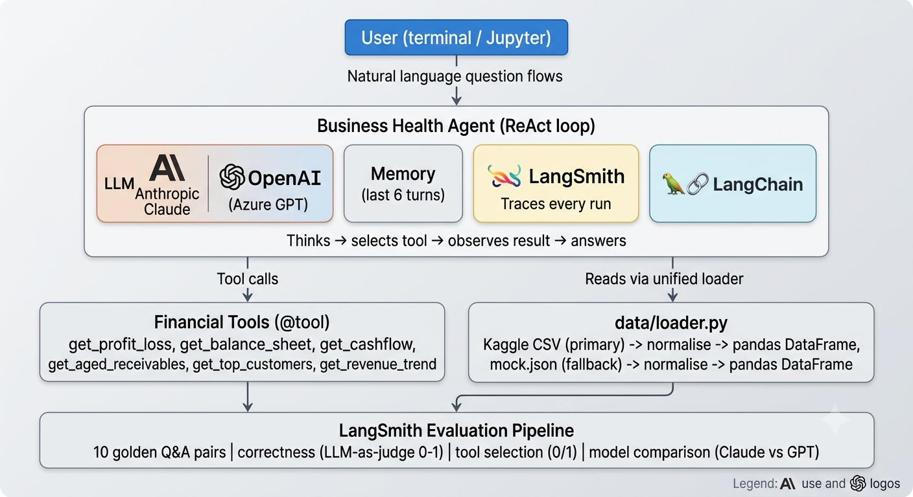

# 💼 Business Health Agent 
 
> *A hands-on AI engineering project demonstrating LangChain, LangSmith, and Azure-ready agent development for small business financial analysis.*
 
---
 
## Project Overview
 
The Business Health Agent is a multi-agent AI system that answers natural language questions about a small business's financial health. A business owner can ask questions like *"Is the business profitable this month?"*, *"Who are my top customers?"*, or *"Am I at risk of a cash flow problem?"* — and receive clear, data-driven answers in plain English.
 
The system is built entirely in Python, runs in the terminal or Jupyter, and is designed to be deployable on Azure. It reads from a real financial dataset (Kaggle Small Business Financial Dataset 2022–2023) with automatic fallback to mock data, making it self-contained for demonstration purposes.
 
This project was built as a working, runnable implementation — not a theoretical exercise. Every error encountered during development is documented, every fix is real, and every design decision reflects the kind of judgment expected of a senior AI/Cloud engineer.
 
 ## Aim and Objectives
 
**Aim:** Demonstrate practical, production-oriented AI engineering skills by building a working LangChain agent with real data, real evaluations, and real deployment considerations.
 
**Objectives:**
 
- Build a ReAct-pattern LangChain agent that reasons across multiple financial tools
- Implement at least 6 domain-specific tools wrapping real financial data
- Wire LangSmith for automatic tracing of every agent run
- Design and run structured evaluations (correctness + tool selection) using LangSmith
- Implement conversation memory so multi-turn questions work naturally
- Write a robust data layer that reads from Kaggle CSV with JSON fallback
- Demonstrate Azure deployment readiness via environment-based LLM switching
- Document the full implementation journey including real errors and solutions
---
 
## What I Am Hoping to Learn
 
| Area | What I want to understand |
|---|---|
| **LangChain agents** | How ReAct reasoning loops work in practice — not just theory |
| **LangSmith** | How to trace, evaluate, and compare agent runs using LLM-as-judge scoring |
| **Prompt engineering** | How system prompt structure affects agent reliability and tool selection |
| **Data engineering for AI** | How to normalise raw CSV data into a schema that tools can reason over |
| **LLM provider switching** | How to build provider-agnostic code (Azure OpenAI / Claude / OpenAI) |
| **Evaluation design** | How to write golden Q&A pairs that measure what actually matters |
| **Python packaging** | How dependency conflicts in fast-moving ML libraries are diagnosed and resolved |
| **AI security** | Why secret scanning, `.gitignore`, and key rotation matter in AI projects |
 
---
## Technology Stack
 
| Layer | Technology | Purpose |
|---|---|---|
| **Agent framework** | LangChain (langchain-classic) | ReAct agent loop, tool binding, memory |
| **LLM — primary** | Anthropic Claude Sonnet 4.5 | Agent reasoning and LLM-as-judge evaluation |
| **LLM — Azure path** | Azure OpenAI (GPT-4o) | Production LLM via Azure AI Foundry |
| **Tracing & evals** | LangSmith | Automatic run logging, eval datasets, scoring |
| **Data processing** | pandas, NumPy | CSV ingestion, aggregation, financial calculations |
| **Data source** | Kaggle Small Business Financial Dataset 2022–2023 | Real transaction-level financial data |
| **Fallback data** | Mock JSON (mock.json) | Self-contained demo without Kaggle dependency |
| **Runtime** | Python 3.14, virtualenv | Isolated dependency management |
| **Version control** | Git, GitHub | Source control with secret scanning protection |
| **Configuration** | python-dotenv | Environment-based secrets management |
| **Notebook** | Jupyter | Interactive exploration and demo |
| **Target deployment** | Azure Container Apps | Containerised production deployment |
 
---
 
## Architecture Diagram and Implementation Guide 




```
 

## Project Structure

```
business-health-agent/
├── data/
│   ├── loader.py           ← unified CSV + JSON loader (edit COLUMN_MAP here)
│   ├── mock.json           ← fallback data (no Kaggle needed)
│   └── kaggle/             ← drop your Kaggle CSV files here
│       └── *.csv
├── tools/
│   ├── financial_tools.py  ← 7 LangChain @tools (CSV-aware)
│   └── inspect_schema.py   ← run this first to check your CSV columns
├── agents/
│   └── business_health_agent.py
├── evals/
│   ├── golden_qa.json
│   ├── run_evals.py
│   └── compare_models.py
├── config/
│   └── .env.example
└── requirements.txt
```

---

## Quick Start

### 1. Install
```bash
python3 -m venv .venv && source .venv/bin/activate
pip install -r requirements.txt
```

### 2. Configure
```bash
cp config/.env.example config/.env
# Edit config/.env — add your ANTHROPIC_API_KEY and LANGSMITH_API_KEY
```

### 3. Add Kaggle data (optional but recommended)
```bash
# Get your kaggle dataset from kaggle.com https://www.kaggle.com/datasets/gabriellecharlton/coffee-shop-financial-dataset-synthetic-2022-2023?resource=download
Data set is already in the relevant folder

# Download the dataset
kaggle datasets download \
  -d gabriellecharlton/coffee-shop-financial-dataset-synthetic-2022-2023 \

# Inspect columns to verify mapping
python tools/inspect_schema.py
```

If no CSV is found, the agent automatically uses `data/mock.json` — so it works out of the box.

### 4. Run the agent
```bash
# Interactive
python agents/business_health_agent.py

# Single question
python agents/business_health_agent.py -q "Is the business profitable this month?"

# Streaming
python agents/business_health_agent.py --stream
```

### 5. Run evals
```bash
python evals/run_evals.py
```

### 6. Compare models
```bash
python evals/compare_models.py
```

---

## How CSV support works

```
data/kaggle/*.csv
       │
       ▼
data/loader.py  ← normalises any CSV into standard columns
       │           (date, account, category, debit, credit, vendor, ...)
       ▼
tools/financial_tools.py  ← computes P&L, cashflow, receivables via pandas
       │
       ▼
Agent tools  ← same interface regardless of data source
```

If your CSV has different column names, edit `COLUMN_MAP` in `data/loader.py` — no other files need changing.

---

## Tools

| Tool | What it computes |
|---|---|
| `get_profit_loss(period)` | Revenue, COGS, opex, net profit, margins |
| `get_balance_sheet(date)` | Assets, liabilities, equity, ratios |
| `get_cashflow(period)` | Operating/investing/financing flows |
| `get_cashflow_forecast(months)` | Trend-based projection + risk flag |
| `get_aged_receivables()` | Outstanding by vendor, aging buckets |
| `get_top_customers(limit)` | Revenue by customer/vendor |
| `get_revenue_trend(months)` | Month-by-month growth + direction |


 
## Challenges and Solutions
 
### 1. LangChain breaking changes — `AgentExecutor` import failure
**Challenge:** After installing the latest LangChain (1.x), `from langchain.agents import AgentExecutor` raised an `ImportError`. The class had moved entirely.
 
**Solution:** Traced the new package structure and found `AgentExecutor` had been moved to `langchain-classic`, a compatibility shim package. Updated all affected imports (`agents`, `memory`, `prompts`) to reference `langchain_classic`. Added explicit version pinning guidance to `requirements.txt`.
 
**Learning:** Fast-moving ML libraries break imports between minor versions. Always test installs in a clean virtualenv and check the migration guide before upgrading.
 
 
---
 
### 2. CSV data source integration — schema uncertainty
**Challenge:** The Kaggle dataset is login-gated, so the exact column names couldn't be verified without downloading it. Writing tools against assumed column names would break silently.
 
**Solution:** Built a flexible `COLUMN_MAP` dictionary in `data/loader.py` that maps many possible column name variants to internal standard names. Added `tools/inspect_schema.py` — a diagnostic script that prints every CSV column, its data type, sample values, and which COLUMN_MAP entries matched or failed. The agent works with mock JSON if no CSV is present, giving a working demo regardless.
 
**Learning:** Defensive data loading with explicit column mapping is more robust than assuming schema. A diagnostic script pays for itself in the first debugging session.
 
---
 
### 3. LLM model name mismatch — 404 from Anthropic API
**Challenge:** The agent started successfully but crashed with a 404 error: `model: claude-sonnet-4-20250514 not found`. The model string in `.env` was wrong for the API tier.
 
**Solution:** Updated `ANTHROPIC_MODEL` in `config/.env` to `claude-sonnet-4-5`, which is the correct model identifier for the available API access level.
 
**Learning:** Model identifiers are version-specific and tier-specific. Always verify the exact string against the provider's current model list, not documentation that may be outdated.
 
---
 
### 4. Balance sheet computed from transactions — approximation risk
**Challenge:** The Kaggle dataset contains raw transactions, not pre-computed financial statements. A real balance sheet requires an accounting system; deriving one from transactions requires assumptions.
 
**Solution:** Built the `get_balance_sheet` tool to compute approximate figures from transaction history (cash = net of all credits/debits, receivables = 15% of credited revenue, inventory = 20% of COGS). Added an explicit `note` field in the tool output stating the figures are computed approximations. The mock JSON fallback contains hand-crafted realistic balance sheet figures for demo purposes.
 
**Learning:** Transparency about data quality is as important as the data itself. An agent that presents approximations as facts is more dangerous than one that clearly labels its assumptions.
 
---
 
## Key Learnings
 
**On AI engineering in practice:**
Building a working agent is 20% prompt design and 80% data plumbing, dependency management, and error handling. The theoretical concepts (ReAct, tool use, memory) are straightforward — the engineering discipline to make them reliable is the real skill.
 
**On LangSmith:**
Tracing is not optional for agent debugging. Without LangSmith, a wrong answer from the agent is a black box. With tracing, you can see exactly which tool was called, what it returned, how the LLM interpreted it, and where the reasoning went wrong. Evals with LLM-as-judge scoring provide a reproducible benchmark that lets you compare models or prompt changes objectively.
 
**On LangChain:**
The library is powerful but evolves rapidly. Understanding the underlying pattern (prompt → LLM → parser → tool loop) matters more than memorising the current import paths, which change between versions.
 
**On security:**
API key hygiene is not bureaucracy — it is a core engineering responsibility. Secrets in git history are permanently compromised even after deletion, because the history is replicated across every clone. Rotate first, fix second.
 
**On Azure readiness:**
Environment-based LLM switching (Azure OpenAI / Claude / OpenAI via a single env var) is the right pattern for enterprise deployment. It means the same codebase runs locally with Claude and in production with Azure OpenAI without any code changes.
 
---
## About
 
**Sandeep Hegde** is an AWS/Azure Cloud Professional, Engineering Manager, Solution Architect, and AI Engineer with hands-on experience across cloud infrastructure, platform engineering, and applied AI.
 
This project represents a personal investment in demonstrating an entry level into learning LangSmith for AI engineering using Python — not just theoretical knowledge, but working, hands-on implementation with real errors, real solutions, and real learnings documented throughout.
 
The goal is not to present a polished, perfect project, but to demonstrate the engineering mindset: the ability to navigate ambiguous tooling, debug systematically, make pragmatic decisions under time pressure, and ship something that actually runs.
 
> *"The best way to learn AI engineering is to build something that breaks, fix it, and document why."*
 
---
 
**GitHub:** [github.com/sandeep-ssh/business-health-agent](https://github.com/sandeep-ssh/business-health-agent)
 
**Dataset:** [Kaggle — Small Business Financial Dataset 2022–2023](https://www.kaggle.com/datasets/gabriellecharlton/coffee-shop-financial-dataset-synthetic-2022-2023)
 
**Tracing & Evals:** [LangSmith](https://smith.langchain.com)